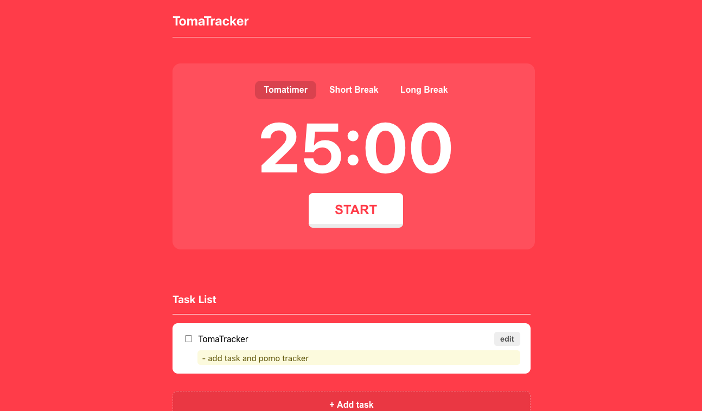

<h1 align="center">TomaTracker</h1>
<p>
  
  <a href="https://twitter.com/sophia_wyl">
    
  </a>
</p>

> TomaTracker is productivity tool based off the [pomodoro method](https://en.wikipedia.org/wiki/Pomodoro_Technique), with a built in task list integration.

Live site: https://tomatracker.netlify.app



## Tech

Built with React.

## Install

1. Clone repository to your local machine

```sh
git clone https://github.com/sophi-li/task-list.git
```

2. Navigate into the repository

```sh
cd task-list
```

3. Install modules, & run live server

```
npm install
npm run start
```

## Author

👤 Sophia

- Twitter: [@sophia_wyl](https://twitter.com/sophia_wyl)
- GitHub: [@sophi-li](https://github.com/sophi-li)
